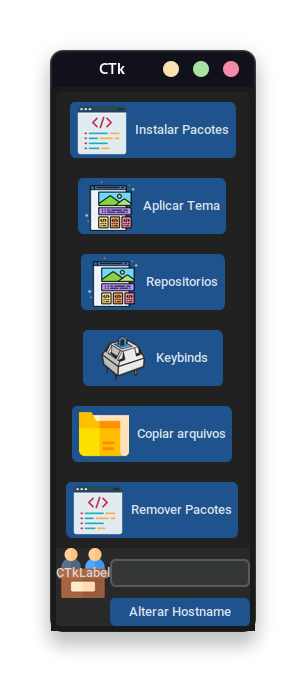

# Python script opensuse




> Configuração pos instalação do Opensuse tumbleweed usando python.

### O projeto

Este é apenas um projeto para meus usos pessoais, você está bem vindo a usar parte do codigo caso o convenha

Antes de começar, verifique se você atendeu aos seguintes requisitos:
* Verifique se você tem o `Zenity, Git, Flatpak e permissão superusuario`

## 🚀 Baixando o script

Para baixar o script, siga estas etapas:

```
git clone https://github.com/JakeMartinezz/python-suse.git
```
## ☕ Usando o script

Para usar o script, siga estas etapas:

> Script Gui

```
Todas as funçoes estão listadas, apenas clique em ok e a função ira rodar
```

## 🕔 Lista de funções

```
Aplicar Tema
```

> Configura o tema GTK, o tema de ícones e o tema do cursor, além de definir uma imagem de plano de fundo.

```
Copiar Tema
```

> copia arquivos de temas e icones  para suas respectivas pastas no sistema.

```
Instalar Pacotes
```

> Instala uma lista de pacotes usando o gerenciador de pacotes do sistema, como sublime-text, steam

```
Keybinds
```

> Adiciona atalhos para as funçoes de mudar de janela, fechar janela, microfone e captura de tela

```
Remover Pacotes
```

> Remove uma lista de pacotes, os pacotes incluem vários aplicativos GNOME

```
Repositórios
```

> Esta função adiciona repositórios, como Packman

```
Trocar Hostname
```
> Permite ao usuário trocar o nome do host do sistema.

## 📫 Contribua para o script!
Para criar seu fork, siga estas etapas:

1. Bifurque este repositório.
2. Crie um branch: `git checkout -b main`
3. Faça suas alterações e confirme-as: `git commit -m 'Seu commit'`
4. Envie para o branch original: `git push origin shell-suse / local`
5. Crie a solicitação de pull.

Como alternativa, consulte a documentação do GitHub em [como criar uma solicitação pull](https://help.github.com/en/github/collaborating-with-issues-and-pull-requests/creating-a-pull-request).

## 🎉 Notas

> Sou um programador tentando suprir minhas necessidades de automaçoes

> Assinado: Jake


